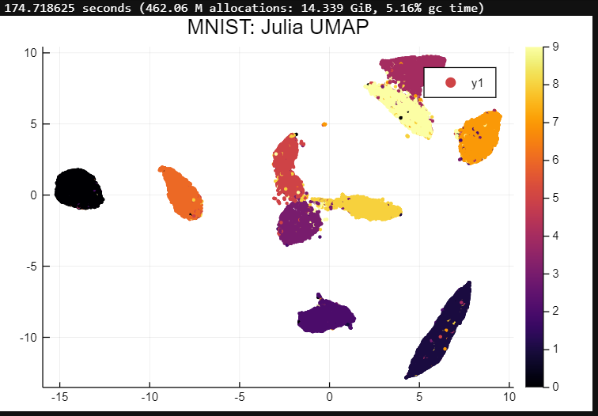
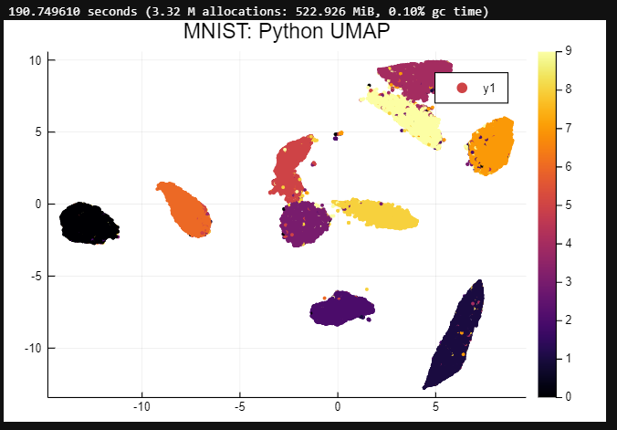
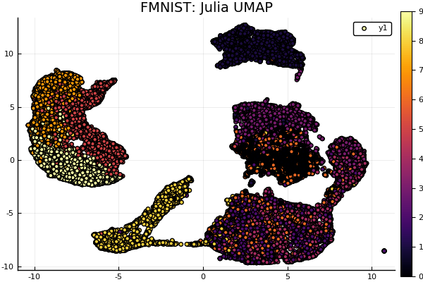
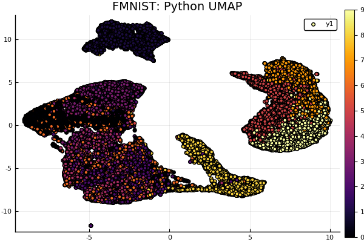

# UMAP.jl (WIP)
[](https://travis-ci.com/dillondaudert/UMAP.jl)[](https://coveralls.io/github/dillondaudert/UMAP.jl?branch=master) [](https://codecov.io/gh/dillondaudert/UMAP.jl)

A straightforward implementation of the [Uniform Manifold Approximation and Projection](https://arxiv.org/abs/1802.03426) dimension reduction
algorithm in Julia.

> McInnes, L, Healy, J, *UMAP: Uniform Manifold Approximation and Projection for
> Dimension Reduction*. ArXiV 1802.03426, 2018

## Usage
```jl
embedding = umap(X, n_components; n_neighbors, metric, min_dist, ...)
```
The `umap` function takes two arguments, `X` and `n_components` - the data to be
embedded and the number of dimensions in the output embedding, respectively - and
several keyword arguments:
- `n_neighbors::Int=15`: This controls how many neighbors around each point are considered to be part of its local neighborhood. Larger values will result in embeddings that capture more global structure, while smaller values will preserve more local structures.
- `metric::SemiMetric=Euclidean()`: The (semi)metric to use when calculating distances between points. This can be any subtype of the `SemiMetric` type from the `Distances.jl` package, including user-defined types.
- `min_dist::Float=0.1`: This controls the minimum spacing of points in the embedding. Larger values will cause points to be more evenly distributed, while smaller values will preserve more local structure.


## Examples
The full MNIST and FMNIST datasets are plotted below using both this implementation and the [Python implementation](github.com/lmcinnes/umap) for comparison. These were generated by [this notebook](PlotMNIST.ipynb).

### MNIST



### FMNIST



## Disclaimer
This implementation is a work-in-progress. If you encounter any issues, please create
an issue or make a pull request.
